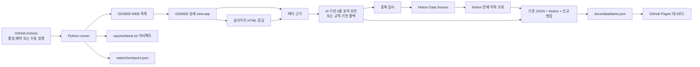
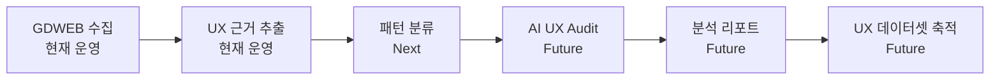

# Web UX Archive — Product & Technical Journey

## 1. 프로젝트 개요

Web UX Archive는 GDWEB의 WEB 부문 신규 선정작을 평일마다 확인하고, GDWEB 상세와 실사이트에서 수집한 근거를 입력으로 AI가 6줄 UX 분석 초안을 생성해 Notion과 웹 대시보드에 축적하는 개인 UX 리서치 파이프라인이다.

초기의 흐름은 `GPT 예약 실행 → Notion 저장`이었다. 현재는 `GitHub Actions 자동 수집 → 근거 추출 → AI 기반 분석 초안 → Notion 등록 및 전체 이력 동기화 → GitHub Pages 탐색` 구조로 발전했다.

현재 운영 상태는 다음과 같다.

| 항목 | 상태 |
| --- | --- |
| GitHub 저장소 | [jkrakisis/web-ux](https://github.com/jkrakisis/web-ux) |
| 공개 대시보드 | [GDWEB UX Monitor](https://jkrakisis.github.io/web-ux/) |
| 원본 데이터베이스 | [GDWEB WEB 선정작 Notion DB](https://app.notion.com/p/karauiux/33569790c14381a3ab95dd3583900198?v=33569790c143812f809c000cc2bd351d) |
| 자동 실행 | 한국시간 기준 평일 08:37 예약 + 수동 실행 |
| 최신 검증 결과 | 누적 54건, 등록일 23일, 신규 0건, 실패 0건 |
| 로컬 저장소 | `D:\codex\gdweb-daily` |

## 2. Why I Built This

매일 새로운 웹사이트를 참고하기 위해 GPT 예약 기능과 Notion을 함께 사용했다. 실제로 운영해 보니 세 가지 문제가 반복됐다.

1. GPT 예약 실행이 누락되거나 원하는 시점에 결과를 받지 못하는 경우가 있었다.
2. Notion은 데이터를 구조적으로 저장하기에는 좋지만, 매일 새로운 레퍼런스를 빠르게 훑어보기에는 정보 밀도와 가독성이 맞지 않았다.
3. 신규 사이트 확인, 상세 정보 수집, UX 분석, 중복 검사, 기록이 반복적인 수작업으로 남아 있었다.

결국 필요한 것은 단순한 예약 작업이 아니라, 실행 여부를 추적할 수 있고 데이터가 누적되며 브라우저에서 빠르게 탐색할 수 있는 작은 서비스였다.

## 3. 해결 방식 탐색

해결안을 선택할 때 다음 기준을 사용했다.

- 별도 서버를 계속 운영하지 않아도 될 것
- 실행 기록과 실패 로그를 확인할 수 있을 것
- 평일 예약 실행과 수동 재실행을 모두 지원할 것
- Notion을 기존 데이터 자산으로 계속 활용할 것
- 정적 웹으로 빠르게 배포할 수 있을 것
- 이후 AI 분석과 태그 체계를 확장할 수 있을 것

이 기준에 따라 Python 수집기, GitHub Actions, Notion API, GitHub Pages를 조합한 구조를 선택했다. GitHub 저장소가 코드·상태·공개 데이터의 버전 이력을 맡고, Notion은 구조화된 UX 아카이브의 원본 데이터베이스 역할을 맡는다.

## 4. 발전 과정

### 4.1 GPT 예약과 Notion으로 시작

최초에는 GPT의 예약 기능으로 GDWEB 신규 선정작을 확인하고 결과를 Notion에 저장했다. 빠르게 시작할 수 있었지만 실행 보장, 장애 확인, 누적 데이터의 웹 탐색 측면에 한계가 있었다.

### 4.2 독립 실행 가능한 Python 수집기 구축

수집과 분석 과정을 Python 패키지로 분리했다. 로컬과 GitHub Actions에서 같은 명령을 실행할 수 있도록 `python -m gdweb_daily` 진입점을 만들었다.

주요 처리 단계는 다음과 같다.

1. 마지막 성공 실행 시각과 최근 조회 구간 계산
2. GDWEB WEB 목록 조회
3. 상세 페이지에서 실사이트, 제작사, 표현방법, 콘셉트, 색상 확보
4. 실사이트 HTML과 응답에서 기술 근거 수집
5. OpenAI 또는 근거 기반 폴백 분석으로 6줄 요약 생성
6. Notion 스키마 및 중복 확인
7. 신규 행 생성
8. 보고서, 체크포인트, 대시보드 JSON 생성

### 4.3 GitHub Actions 예약 실행

운영 서버 대신 GitHub Actions를 스케줄러와 실행 환경으로 사용했다. 실행 이력, 단계별 로그, 아티팩트, 실패 알림을 GitHub에서 확인할 수 있게 됐다.

예약 실행 외에도 `workflow_dispatch`를 제공해 변경 직후 또는 장애 후 즉시 재실행할 수 있다. 실등록과 점검 실행을 구분하기 위해 `dry_run` 입력과 `LIVE_ENABLED` 저장소 변수를 사용한다.

### 4.4 GitHub Pages 대시보드 추가

Notion만으로는 매일 참고할 사이트를 빠르게 탐색하기 어려워 `docs/` 아래에 정적 대시보드를 만들었다. 별도 프런트엔드 빌드 시스템 없이 HTML, CSS, JavaScript와 JSON만으로 동작한다.

### 4.5 로컬 환경 정리

저장소를 `D:\codex\gdweb-daily`로 이동하고 프로젝트 전용 가상환경 `.venv`를 구성했다. 가상환경은 프로젝트 의존성을 시스템 Python과 분리하여 재현 가능한 실행 및 테스트 환경을 유지하기 위해 사용한다.

### 4.6 누적 이력과 일별 보기 복구

초기 대시보드는 매 실행의 신규 항목만 `docs/data/latest.json`에 저장했다. 신규가 없는 날에는 `items`가 빈 배열로 덮어써져 이전 카드가 모두 사라지는 문제가 발생했다.

이를 다음과 같이 수정했다.

- 기존 JSON과 신규 항목을 병합해 누적 보존
- `str_no`, 또는 `도메인 + 등록일`로 중복 제거
- 등록일별 필터와 전체 날짜 보기 추가
- `신규 건수`와 `누적 건수`를 분리 표시
- 최신 등록일을 기본 필터로 선택
- 실행 이력을 `run_history`에 제한적으로 누적

### 4.7 Notion 전체 이력을 데이터 원천으로 연결

로컬 JSON에는 13건만 있었지만 Notion DB에는 2026-03-03부터 2026-07-17까지 54건, 23일치가 있었다. 일회성 복사 대신 매 실행마다 Notion 전체 비보관 행을 조회해 대시보드 형식으로 변환하고 기존 JSON과 병합하도록 변경했다.

이제 Notion은 저장 대상인 동시에 대시보드의 장기 이력 원천이다. 브라우저에서 Notion API를 직접 호출하지 않고 GitHub Actions 안에서만 토큰을 사용하므로 공개 페이지에 인증 정보가 노출되지 않는다.

## 5. 최종 아키텍처



## 6. 코드 구조

| 파일 | 역할 |
| --- | --- |
| `src/gdweb_daily/runner.py` | 전체 실행 조정, 체크포인트, 보고서 및 대시보드 생성 |
| `src/gdweb_daily/gdweb.py` | GDWEB 목록·상세 페이지 수집 및 파싱 |
| `src/gdweb_daily/website.py` | 실사이트 접근, 메뉴·CTA·기술 근거 수집 |
| `src/gdweb_daily/analysis.py` | 근거 기반 AI 분석 초안, 규칙 기반 폴백, 고정 6줄 포맷 생성 |
| `src/gdweb_daily/notion.py` | 스키마 조회, 옵션 매핑, 중복 확인, 행 생성, 전체 이력 동기화 |
| `src/gdweb_daily/state.py` | 이전 실행 시각과 처리한 `str_no` 관리 |
| `src/gdweb_daily/config.py` | 환경 변수와 실행 설정 로딩 |
| `docs/index.html` | 대시보드 문서 구조 |
| `docs/app.js` | JSON 로드, 날짜·검색 필터, 카드 렌더링 |
| `docs/styles.css` | 반응형 대시보드 스타일 |
| `.github/workflows/daily.yml` | 수집·Notion 등록·데이터 저장·Pages 배포 |
| `.github/workflows/pages.yml` | `docs/**` 변경 시 정적 대시보드 배포 |
| `tests/` | 파서, Notion 매핑, 이력 병합 회귀 테스트 |

## 7. 데이터 수집과 근거 원칙

분석 품질을 유지하기 위해 추측보다 확인 가능한 근거를 우선한다.

### GDWEB 상세 우선 필드

- `str_no`
- 사이트명과 등록일
- 실사이트 바로가기
- 제작사
- 표현방법
- 디자인 콘셉트
- 색상

### 실사이트 관찰 필드

- 최종 도메인과 접근 가능 여부
- 메뉴 및 CTA 라벨
- 메타 설명
- HTML과 스크립트 경로에서 확인한 기술
- 응답 헤더 또는 플랫폼 흔적

기술 키워드는 HTML 또는 응답에서 근거가 확인된 경우에만 기록한다. 예를 들어 `gsap.min.js`, `swiper`, `jquery`, `googletagmanager`, `cafe24` 등의 문자열을 근거로 사용한다.

## 8. 6줄 UX 분석 포맷

각 신규 사이트는 수집된 근거를 입력으로 다음 고정 구조의 분석 초안을 생성한다.

1. 사이트명, 등록일, GDWEB 상세, 실사이트
2. 목적, 타겟, IA
3. 핵심 UX 패턴
4. 강점
5. 개선 포인트
6. 기술·플러그인 근거와 A) IA 퀵액션, B) KPI, C) 공공기관 Do/Don't, D) 오늘의 한 줄

이 구조는 매일 결과를 빠르게 비교하고 Notion의 개별 프로퍼티와 대시보드 카드에 동일한 정보를 재사용하기 위한 계약이다.

### 8.1 현재 자동화 범위

| 구분 | 자동화 수준 |
| --- | --- |
| 사실 수집 | GDWEB 메타, 실사이트 URL, 메뉴·CTA, HTML 기반 기술 근거를 규칙으로 수집 |
| AI 생성 | 수집된 근거 안에서 목적·타겟·IA, UX 패턴, 강점, 개선점, KPI·퀵액션 제안 초안 생성 |
| 폴백 생성 | OpenAI API를 사용할 수 없을 때 규칙 기반 템플릿으로 6줄 초안 생성 |
| 사람의 역할 | 결과 검토, 근거 해석, 최종 평가와 개선 우선순위 판단 |

현재 시스템은 전체 화면을 시각적으로 판독하는 정식 휴리스틱 평가 도구가 아니다. 사용성 테스트, 과업 성공률 측정, WCAG 기반 접근성 감사, 성능 측정과 종합 AI UX Audit은 아직 구현 범위에 포함되지 않는다.

## 9. Notion 연동 설계

### 9.1 사전 스키마 조회

행을 생성하기 전에 Data Source 스키마를 조회한다. 프로퍼티 이름은 의미별 별칭으로 해석하며, 실제 DB 이름이 다르면 `NOTION_PROPERTY_MAP`으로 명시할 수 있다.

예시 의미 매핑:

| 의미 | 현재 DB 프로퍼티 예시 |
| --- | --- |
| 제목 | 사이트명 |
| 등록일 | 등록일 |
| GDWEB 링크 | GDWEB 상세 |
| 실사이트 링크 | 실사이트 |
| 요약 | 요약(6줄) |
| 기술 | 기술/플러그인 키워드 |
| 확인 시각 | Last check 시각 |

### 9.2 select와 multi_select 안전 처리

자동화가 DB 스키마를 임의로 확장하지 않도록 기존 옵션만 사용한다.

1. 완전히 같은 옵션명이 있으면 해당 옵션 `id` 사용
2. 유사도가 충분한 기존 옵션이 있으면 가장 가까운 옵션으로 매핑
3. 적절한 옵션이 없으면 그 프로퍼티 값만 제외
4. 제외된 값도 6줄 텍스트의 근거에는 유지

### 9.3 중복 방지

중복 검사는 다음 순서로 수행한다.

1. 동일한 GDWEB `str_no`
2. 동일한 실사이트 도메인과 등록일
3. DB에 도메인 프로퍼티가 없을 경우 실사이트 URL 변형과 등록일

대시보드 병합도 같은 식별 원칙을 사용한다. 새 데이터의 비어 있지 않은 필드만 기존 항목에 덮어써 기존의 더 풍부한 제작사·기술·근거 데이터가 사라지지 않게 한다.

### 9.4 전체 이력 동기화

Notion API는 한 번에 최대 100개 행을 요청하고 `next_cursor`가 있으면 다음 페이지를 계속 조회한다. 각 행은 대시보드 카드 형식으로 변환된다.

- 프로토콜 없는 링크는 웹 표시용으로 `https://` 보정
- GDWEB URL에서 `str_no` 추출
- 실사이트 URL에서 도메인 추출
- `요약(6줄)`이 있으면 줄 단위로 사용
- 요약이 없는 과거 행은 목적·IA·패턴·강점·개선·기술 프로퍼티로 6줄 생성

## 10. 체크포인트와 조회 구간

GDWEB 등록일은 날짜 단위로 제공되므로 정확한 시각 비교만으로는 경계 항목을 놓칠 수 있다. 이를 방지하기 위해 최근 7일을 겹쳐 조회하고 이미 처리한 `str_no`를 다시 제거한다.

`state/checkpoint.json`에는 이전 실행 시작·완료 시각과 처리된 식별자가 저장된다. 체크포인트는 실등록 실행이 성공했을 때만 갱신한다. 실패 실행이 마지막 성공 시각을 앞으로 이동시켜 신규 항목을 누락하는 문제를 방지하기 위한 설계다.

## 11. 대시보드 데이터 모델

`docs/data/latest.json`의 핵심 구조는 다음과 같다. 아래 코드는 실제 `items` 누적 데이터 배열 54건 중 1건만 구조 설명을 위해 발췌한 예시다.

```json
{
  "generated_at": "ISO 8601 datetime",
  "mode": "live",
  "status": "no_new",
  "new_count": 0,
  "failure_count": 0,
  "total_count": 54,
  "items": [
    {
      "str_no": "27271",
      "site_name": "더가든피부과",
      "registered_date": "2026-07-17",
      "detail_url": "https://www.gdweb.co.kr/sub/view.asp?str_no=27271",
      "live_url": "https://thegardenclinic.co.kr/",
      "domain": "thegardenclinic.co.kr",
      "technologies": ["jQuery", "GSAP", "Swiper"],
      "lines": [
        "1) 사이트·등록일·링크",
        "2) 목적·타겟·IA",
        "3) 핵심 UX 패턴",
        "4) 강점",
        "5) 개선 포인트",
        "6) 기술 근거·퀵액션·KPI·공공 Do/Don't·오늘의 한 줄"
      ]
    }
  ],
  "preview_items": [],
  "available_dates": ["2026-07-17", "2026-07-16"],
  "run_history": [],
  "failures": []
}
```

`items`는 누적 사이트 데이터 배열이고 `available_dates`는 실제로 모든 등록일을 포함한다. 위 예시는 가독성을 위해 각각 1건과 2개 날짜만 표시했다. `new_count`는 이번 실행 결과이고 `total_count`는 누적 이력이다. 이 둘을 분리함으로써 `신규 없음`과 `아카이브가 비어 있음`을 다른 상태로 표현한다.

## 12. GitHub Actions 운영

### 12.1 필요한 Secrets

- `OPENAI_API_KEY`
- `NOTION_TOKEN`
- `NOTION_DATA_SOURCE_ID`

### 12.2 선택 Variables

- `OPENAI_MODEL`: 기본값 `gpt-5-mini`
- `NOTION_PROPERTY_MAP`: DB 이름이 기본 별칭과 다를 때 사용
- `LIVE_ENABLED`: `true`일 때 예약 실행이 Notion에 실제 등록

Secrets는 Actions 런타임에서만 환경 변수로 전달한다. 공개 JSON과 Pages 파일에는 토큰이나 API 키를 기록하지 않는다.

### 12.3 실행 결과 보존

- `reports/latest.txt`를 실행 ID가 포함된 아티팩트로 30일 보존
- 실등록 성공 시 `state/checkpoint.json` 커밋
- 성공 여부와 관계없이 생성 가능한 `docs/data/latest.json` 커밋
- 수집 작업 이후 Pages 아티팩트 업로드 및 배포

## 13. 장애와 개선 기록

### 13.1 신규 0건일 때 이전 데이터가 사라짐

원인은 매 실행마다 대시보드 `items`를 이번 실행 결과로 교체한 것이었다. 신규가 없으면 빈 배열이 저장되어 화면에 아무 카드도 남지 않았다.

해결:

- 기존 JSON과 신규 데이터를 누적 병합
- 일별 필터 도입
- 누적 건수와 이번 실행 신규 건수 분리
- 이 동작을 회귀 테스트로 고정

### 13.2 이메일에는 collect 실패, deploy-pages 성공으로 표시

GitHub 이메일의 `collect`는 개별 수집 단계가 아니라 여러 단계를 포함한 Job 이름이다. 당시 실제 GDWEB 수집은 성공해 보고서가 `신규 없음`이었지만, 뒤쪽 `Configure GitHub Pages` API에서 일시적인 서버 오류가 발생해 Job 전체가 실패로 표시됐다.

해결:

- 데이터·체크포인트 저장을 Pages 설정보다 먼저 수행
- Pages 설정 단계에 `continue-on-error` 적용
- GDWEB 오류와 Pages 오류가 서로의 데이터 보존을 막지 않도록 분리

### 13.3 GDWEB 오류가 나면 Notion 이력도 게시되지 않음

수집 목록 단계에서 예외가 발생하면 대시보드 생성까지 도달하지 못하는 문제가 있었다.

해결:

- GDWEB 조회 전에 Notion 이력을 먼저 확보
- GDWEB 목록 실패 시에도 보고서와 Notion 기반 JSON 생성
- 수집 단계가 실패해도 대시보드 JSON 저장 단계는 `always()`로 실행
- 성공한 실행에서만 체크포인트 갱신

### 13.4 GitHub CLI 인증 만료

로컬 변경을 게시하려는 시점에 `gh` 토큰이 만료돼 PR 생성과 실행 제어가 중단됐다. `gh auth login -h github.com`의 웹 인증으로 복구한 뒤 커밋, PR, 병합, 수동 실행을 완료했다.

## 14. 검증 기록

2026-07-20 수동 실행 `29742020560`에서 다음을 확인했다.

| 검증 항목 | 결과 |
| --- | --- |
| Python 테스트 | 10 passed |
| Python compileall | 통과 |
| Git diff whitespace 검사 | 통과 |
| Collect and register | 성공 |
| 대시보드·체크포인트 저장 | 성공 |
| GitHub Pages 배포 | 성공 |
| 실행 보고서 | 신규 없음 |
| 공개 JSON | 누적 54, 신규 0, 실패 0 |
| 공개 UI | 최신일 1건, 등록일 옵션 23개, Notion 링크 정상 |

실행 기록: [GitHub Actions run 29742020560](https://github.com/jkrakisis/web-ux/actions/runs/29742020560)

## 15. 로컬 개발과 확인

```powershell
cd D:\codex\gdweb-daily
.\.venv\Scripts\python -m pip install -e ".[dev]"
.\.venv\Scripts\python -m pytest
.\.venv\Scripts\python -m gdweb_daily --dry-run --no-ai
```

실등록은 환경 변수가 준비된 경우에만 수행한다.

```powershell
$env:OPENAI_API_KEY = "..."
$env:NOTION_TOKEN = "..."
$env:NOTION_DATA_SOURCE_ID = "..."
$env:DRY_RUN = "false"
.\.venv\Scripts\python -m gdweb_daily --live
```

GitHub에서 즉시 실행하려면 다음 명령을 사용한다.

```powershell
gh workflow run daily.yml --repo jkrakisis/web-ux --ref main
gh run list --repo jkrakisis/web-ux --workflow daily.yml --limit 5
```

## 16. 현재 얻은 결과

- 반복적인 신규 사이트 확인 작업 감소
- 실행 누락과 실패 원인을 GitHub Actions에서 추적 가능
- Notion의 구조화된 54건을 웹에서 날짜별로 빠르게 탐색
- 신규가 없는 날에도 기존 레퍼런스 유지
- Notion 스키마 변경과 중복 등록에 대한 방어 로직 확보
- GDWEB, Notion, Pages 중 한 부분의 장애가 전체 이력 손실로 이어지지 않는 구조 확보
- 향후 AI 태그, 산업별 필터, 검색, KPI 비교 기능을 확장할 수 있는 기반 마련

## 17. 배운 점

1. 자동화의 핵심은 예약 자체보다 상태, 중복, 실패 복구다.
2. 저장에 좋은 화면과 탐색에 좋은 화면은 다르므로 Notion과 웹의 역할을 분리하는 것이 효과적이다.
3. `신규 0건`은 오류가 아니라 정상 상태이며, 누적 데이터와 별도로 모델링해야 한다.
4. 외부 서비스 연동은 성공 경로보다 부분 실패 시 데이터가 어떻게 보존되는지가 중요하다.
5. AI 분석도 관찰 가능한 근거와 고정 출력 계약을 함께 두어야 운영 데이터로 사용할 수 있다.

## 18. Product Roadmap

최종 목표는 단순한 사이트 모음이 아니라, 반복 관찰 가능한 UX 패턴과 근거 기반 Audit 결과가 축적되는 **UX Pattern Archive**다.



| 단계 | 범위 | 상태 |
| --- | --- | --- |
| 현재 | GDWEB 신규 확인, 메타·HTML 근거 수집, AI 기반 6줄 초안, Notion·웹 아카이브 | 운영 중 |
| Next | 패턴 분류 체계 정의, 산업·유형·패턴 태깅, 비교·필터 기능, UX Pattern Archive 고도화 | 계획 |
| Future | 화면·과업·접근성·성능 근거를 결합한 AI UX Audit, 표준 분석 리포트 생성 | 탐색 |
| 장기 | 프로젝트 간 패턴과 Audit 결과를 비교할 수 있는 UX 데이터셋 축적 | 목표 |

AI UX Audit 단계에서는 현재의 텍스트 기반 분석 초안과 정식 평가를 구분한다. 화면 캡처, 휴리스틱 기준, 접근성·성능 측정값, 근거 위치와 신뢰도를 함께 저장할 수 있을 때 Audit으로 확장한다.

## 19. 구현 백로그

- 산업, 유형, 패턴태그, 기술 키워드 복합 필터
- 패턴 분류 기준과 신뢰도 필드 설계
- Notion `Updated` 기준 증분 동기화
- 사이트 썸네일 생성 및 카드 미리보기
- 접근성·성능 자동 점검과 근거 표시
- 실행 성공률, 신규 건수, 실패 유형 운영 대시보드
- Node.js 24 기반 최신 GitHub Actions 버전으로 순차 업그레이드
- 데이터 백업과 월별 정적 스냅샷

---

이 프로젝트는 작은 개인 자동화에서 시작했지만, 실행 가능성·데이터 지속성·탐색성·장애 복구를 차례로 해결하면서 운영 가능한 UX 리서치 서비스로 발전했다.
